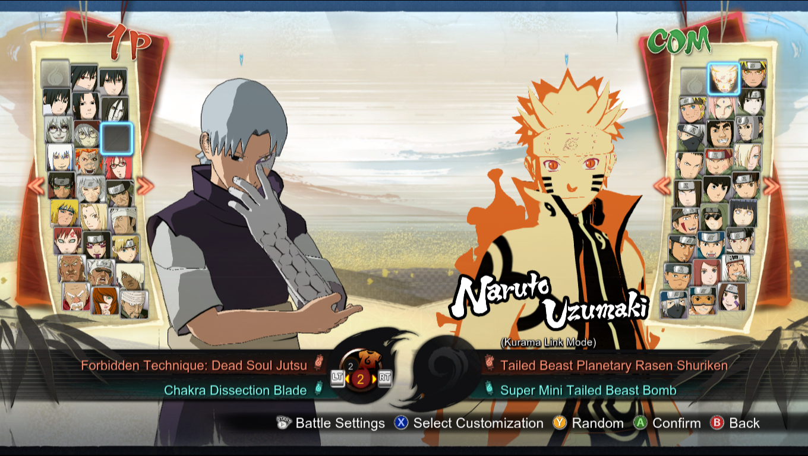
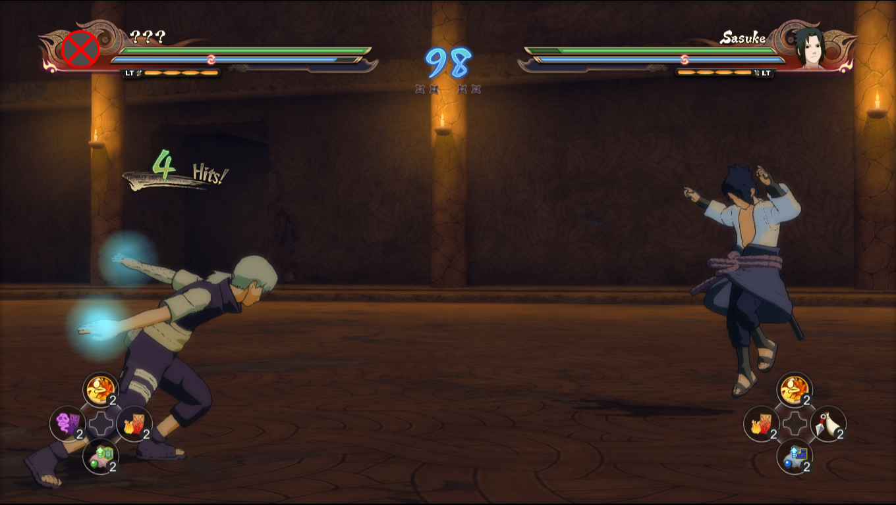
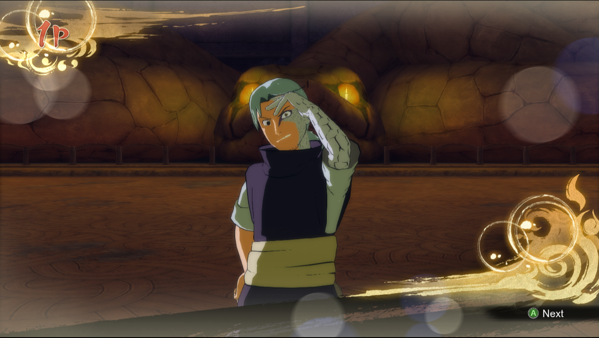

## Requisites

* 3 files extracted from the game's own `data\patch\12\launch.cpk` file using [QuickBMS](../tools/QuickBMS); `duelPlayerParam.xfbin`, `playerSettingParam.bin.xfbin` and `characterSelectParam.xfbin`.

* [Zealot Tormunds' NSUNS4 Character Manager](https://github.com/zealottormunds/ns4charactermanager/releases)

* A character model file *([character id]bod1.xfbin)*. I'll use [Haikal's Posessed Kabuto](https://www.youtube.com/watch?v=L5cwYr0aoPA).
 
* Depending on the situation, you may also need a hex editor such as [HxD](https://mh-nexus.de/en/downloads.php?product=HxD20).

## Instructions

1) Open NSUNS4CM, go to DuelPlayerParam Editor and open your duelPlayerParam.xfbin file.

2) Find the entry of the character you want to modify *(2kbt in my case)* and hit "Edit Costume IDs".

3) Pick an empty/null slot, and write an original ID for your model. Kabuto has no costumes, so I'll use the 2nd slot and give it the ID "4kbt".

4) Submit Entry, Apply Changes, File -> Save, and then you can close the DuelPlayerParam Editor.

5) Go to PlayerSettingParam Editor and open your playerSettingParam.xfbin file.

6) Find the entry of the character you want to modify *(4kbt in my case)* and hit "Create new entry with this data".

7) The new entry will be placed at the bottom. You want to adjust the Costume Slot ID and the Character ID *(1☆ and 4kbt00 in my case, respectively)*.

8) Save Selected Entry, File -> Save, and then you can close the PlayerSettingParam Editor.

9) Go to Character Roster Manager *(CharacterSelectParam.xfbin)* and open your characterSelectParam.xfbin file.

10) Find the entry of the character you want to modify *(4kbt in my case)* and hit "Create new slot with this data".

11) The new entry will be placed at the bottom. You want to adjust the Costume ID and the Character ID *(2☆☆ and 4kbt00 in my case, respectively)*.

12) Save Selected Slot, File -> Save, and then you can close the PlayerSettingParam Editor and test your mod InGame.

If you're sure that you configured the `duelPlayerParam.xfbin`, `playerSettingParam.bin.xfbin` and `characterSelectParam.xfbin` files correctly, and you get a white screen after choosing a stage and before starting a battle, please read the Part 2 down below.

## Instructions (Part 2)

Certain characters may need some extra files. A bod1 file, their model, will not suffice. One such case is Zabuza.

To get new costumes working for them, you'll need to grab some extra files, namely:

`[character id]acc1.xfbin`, `[character id]spl1_bod1.xfbin`, `[character id]dmg01_spl1_bod1.xfbin`.

Once you get those, you'll have to replace the ID with your own costume's using HxD's Replace All feature.

In my case, I added [ChakraWarrior2012's First Zabuza Costume](https://www.deviantart.com/chakrawarrior2012/art/Storm-4-Mod-Zabuza-Momochi-Shirtless-848917297) as a 4th costume for Zabuza using the ID `4zbz`.

So what I did, following [EliteAce](https://www.twitch.tv/videos/1417256510?t=1h26m56s)'s recommendation, was to open each of the 3 aforementioned files in HxD, and replaced the original ID which is `1zbz`, with the ID for my costume, which is again `4zbz`.

Then I put those files inside the `Game_Folder\data_win32\spc` folder, and it just worked, where as before, the game got stuck in a white screen before a battle began.

I also set the Accessory for this new costume inside the NSUNS4 Character Manager's Character Roster Manager to what is now `4zbzacc1`, just in case.

Keep in mind that the accessory loads textures from the character model, so in certain cases, you may need to do some extra work to fix that.

## Notes

* `☆` = The ID number starts at 0.

* `☆☆` = The ID number starts at 1.

* The 3 xfbin files originally extracted from the game's launch.cpk file should be put in the following locations:

  * Game_Folder\data_win32\spc\duelPlayerParam.xfbin

  * Game_Folder\data_win32\spc\WIN64\playerSettingParam.bin.xfbin

  * Game_Folder\data_win32\ui\max\select\WIN64\characterSelectParam.xfbin

* Game_Folder refers to the folder containing the game's basic files, such as NSUNS4.exe.

## Credits

* [Zealot Tormunds](https://nsunsmodding.proboards.com/post/273/thread)

* [EliteAce](https://www.twitch.tv/eliteace170)

## Results

https://user-images.githubusercontent.com/4485172/156933498-e6469c02-f1fe-4556-b74f-d317e13aa94d.mp4