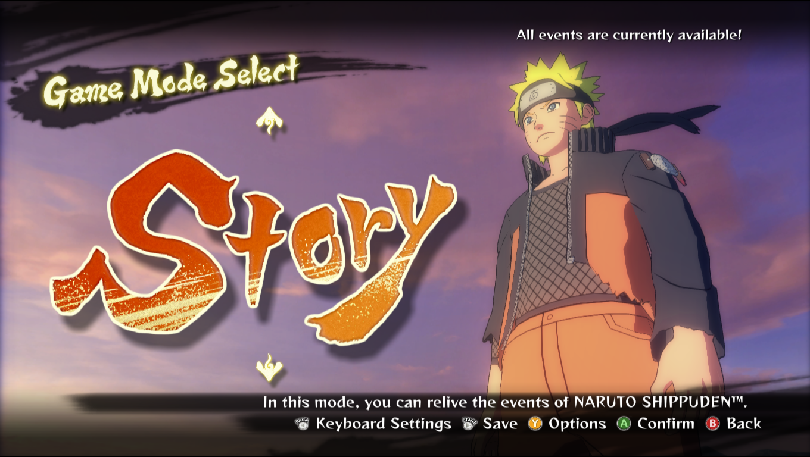
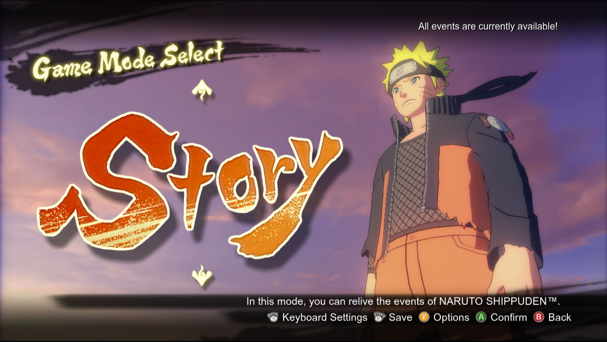

## Requirements

* [JPEXS Decompiler](https://github.com/jindrapetrik/jpexs-decompiler/releases)

## Instructions

1) Open the `Game_Folder\data\ui\flash\OTHER\fonts_family\eng\font.gfx` file in JPEXS.

2) Inside JPEXS, go to font.gfx -> fonts -> DefineFont3, and hit "Embed" in the lower right corner of the program.

3) Choose your new font and check "All Characters" to replace... well, all the characters.

4) A prompt will appear, asking if you really want to do this. Hit "Yes to all". After that, another one will ask you if you want to refresh the contents opened. Hit "Yes".

5) File tab -> Save, and test InGame.

## Credits

* [Kuroha Saenoki](https://www.youtube.com/watch?v=BASTUa6S-YU)

## Result

### Before

### After

