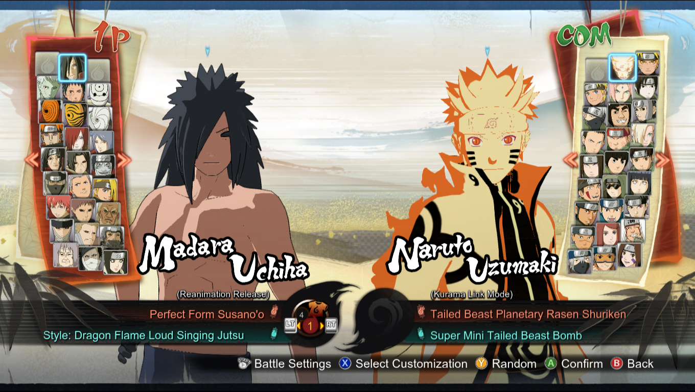

## Requisites

* A character model file *([character id]bod1.xfbin)*. I'll be using a model of Madara without his battle armor, taken from the game's own `Game_Folder\data\launch\data1.cpk` file. It's `bmdnbod1.xfbin`.

* A hex editor such as [HxD](https://mh-nexus.de/en/downloads.php?product=HxD20).

## Instructions

1) Open your [character id]bod1.xfbin file in HxD.

2) Press Ctrl+R, or go to Search -> Replace. Replace the character's own ID, with the ID of the character/costume you want to put your model on.

  * In my case, I'll be swapping the Shirtless Madara with the regular Madara, so using HxD's Replace All, I'll replace `bmdn` with `3mdr`.

3) Lastly, we also need to rename the file to reflect the ID of the character we've put the model in, so we'll rename `bmdnbod1.xfbin` to `3mdrbod1.xfbin`.

## Results

